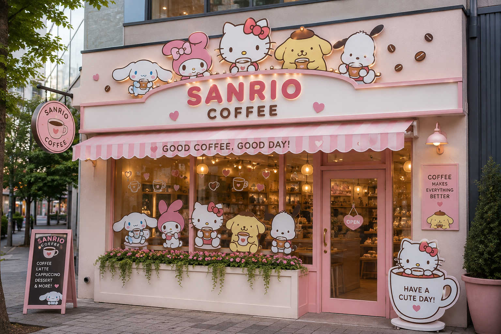

#KittyCofee



## 🌸 Sobre el proyecto

**KittyCofee** es mi primer proyecto web de práctica enfocado en Frontend, inspirado en una cafetería temática kawaii.

La idea del proyecto es crear una experiencia visual y funcional alrededor de una cafetería inspirada en personajes adorables, combinando una interfaz colorida con funcionalidades desarrolladas utilizando **HTML, CSS y JavaScript**.

> ☕🎀 *"Un buen café, un momento especial y un poquito de ternura."*


## ✨ Características

### ☕ Métodos de café

El sitio presenta diferentes bebidas inspiradas en personajes:

* ☁️ Cinnamoroll — Café Filtrado Cremoso
* 🎀 Hello Kitty — Café con Leche
* 🌸 My Melody — Café Dulce
* 🐶 Pochacco — Café Frío
* 🍮 Pompompurin — Café con Espuma

Cada producto incluye:

* Nombre
* Descripción
* Precio
* Botón para agregar al carrito


### 🛒 Carrito de compras

El proyecto cuenta con un carrito interactivo desarrollado con JavaScript.

Permite:

* Agregar productos.
* Aumentar cantidades.
* Disminuir cantidades.
* Eliminar productos.
* Vaciar el carrito.
* Calcular subtotales.
* Calcular el total de la compra.
* Mostrar la cantidad total de productos.
* Finalizar el pedido mediante una ventana de confirmación.


### ☕ Sistema de reservas

También desarrollé un sistema de reserva de tazas.

El usuario puede:

* Consultar las tazas disponibles.
* Reservar entre 1 y 2 tazas.
* Recibir mensajes de validación.
* Ver cómo disminuye automáticamente la cantidad disponible.
* Recibir una confirmación de reserva.
* Ver el sistema deshabilitarse cuando no quedan tazas disponibles.


### 🎀 Personajes

El sitio cuenta con una sección dedicada a los personajes que inspiran las bebidas:

* Cinnamoroll
* Hello Kitty
* My Melody
* Pochacco
* Pompompurin

Cada personaje posee su propia tarjeta con imagen, nombre y descripción.


### 📱 Diseño responsive

La interfaz fue diseñada para adaptarse a diferentes tamaños de pantalla:

* 💻 Computadoras
* 📱 Celulares
* 📲 Tablets

Se utilizaron **CSS Grid, Flexbox y Media Queries** para adaptar el contenido.


## 🛠️ Tecnologías utilizadas

### HTML5

Utilizado para crear la estructura semántica de la página:

* `header`
* `nav`
* `main`
* `section`
* `article`
* `footer`
* Formularios
* Imágenes
* Botones

### CSS3

Utilizado para crear el diseño visual:

* Flexbox
* CSS Grid
* Gradientes
* Sombras
* Bordes redondeados
* Animaciones
* Transiciones
* Hover effects
* Responsive Design
* Media Queries

### JavaScript

Utilizado para agregar interactividad:

* Variables
* Funciones
* Arrays
* Objetos
* `forEach`
* `find`
* Condicionales
* Eventos
* DOM
* `querySelector`
* `addEventListener`
* `dataset`
* `createElement`
* Template literals

### SweetAlert2

Utilizado para mostrar ventanas de confirmación y mensajes interactivos.


## 📂 Estructura del proyecto

```text
KittyCofee/
│
├── index.html
├── style.css
├── script.js
│
├── local-kitty.png
├── footer-kitty.png
│
├── cinnamoroll.png
├── hello-kitty.png
├── my-melody.png
├── pochacco.png
└── pompompurin.png
```


## 🎯 Objetivo del proyecto

Este proyecto forma parte de mi proceso de aprendizaje y práctica en desarrollo **Frontend**.

Mi objetivo es seguir desarrollando proyectos que me permitan mejorar mis conocimientos en:

* HTML
* CSS
* JavaScript
* DOM
* Git
* GitHub
* Responsive Design
* Diseño de interfaces
* Lógica de programación


## 📚 Lo que aprendí

Durante el desarrollo de KittyCofee practiqué conceptos importantes de JavaScript y desarrollo web, entre ellos:

* Manipulación del DOM.
* Manejo de eventos.
* Uso de funciones.
* Arrays y objetos.
* Manejo de cantidades y precios.
* Validación de formularios.
* Uso de `data-*` y `dataset`.
* Creación dinámica de elementos HTML.
* Cálculos con JavaScript.
* Organización de un proyecto frontend.
* Diseño responsive.
* Integración de una librería externa.


## 🔮 Próximas mejoras

Algunas funcionalidades que quiero incorporar en futuras versiones:

* [ ] 💾 Guardar el carrito utilizando `localStorage`.
* [ ] 💾 Guardar las reservas.
* [ ] 💳 Agregar un sistema de checkout simulado.
* [ ] 🔐 Crear un sistema de usuario.
* [ ] 📱 Mejorar todavía más la experiencia mobile.
* [ ] 🖼️ Agregar más contenido visual.
* [ ] 🔎 Agregar filtros de productos.
* [ ] 🌐 Publicar el proyecto online.
* [ ] 🚀 Continuar mejorando el proyecto como parte de mi portfolio Frontend.


## 👨‍💻 Autor

**Augusto Braganza**

Proyecto realizado como parte de mi aprendizaje y preparación para desarrollarme profesionalmente como **Frontend Developer**.


Este proyecto representa uno de mis primeros pasos construyendo una aplicación web interactiva desde cero.


## ☕ KittyCofee

**Café + código + ternura = KittyCofee 🎀**

```text
☕ 💻 🎀
HTML + CSS + JavaScript
        ↓
   KittyCofee
```
